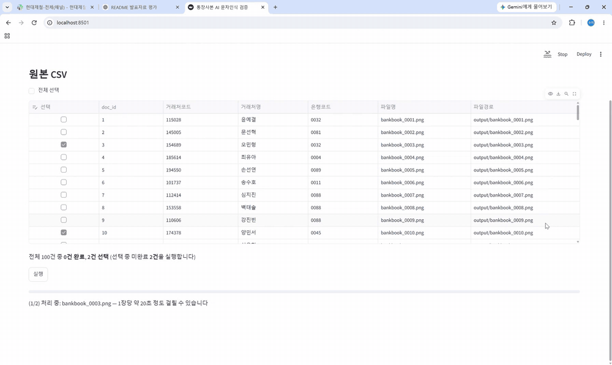
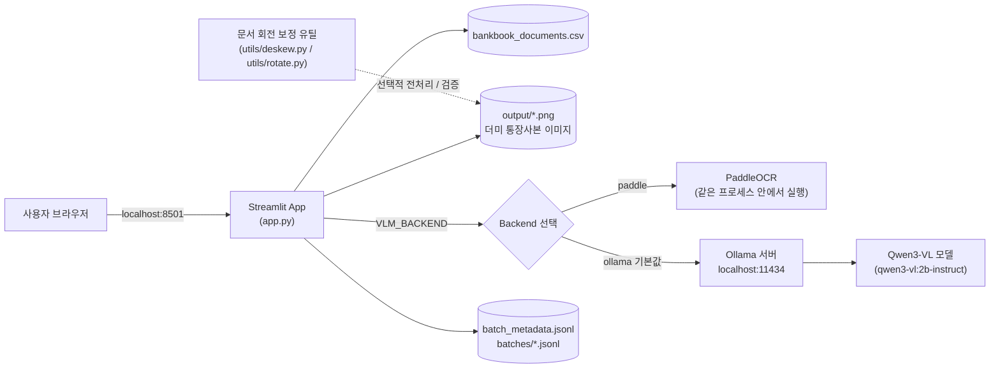
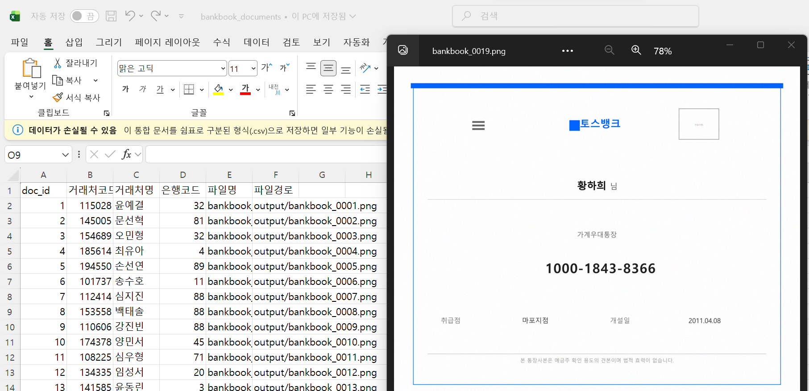
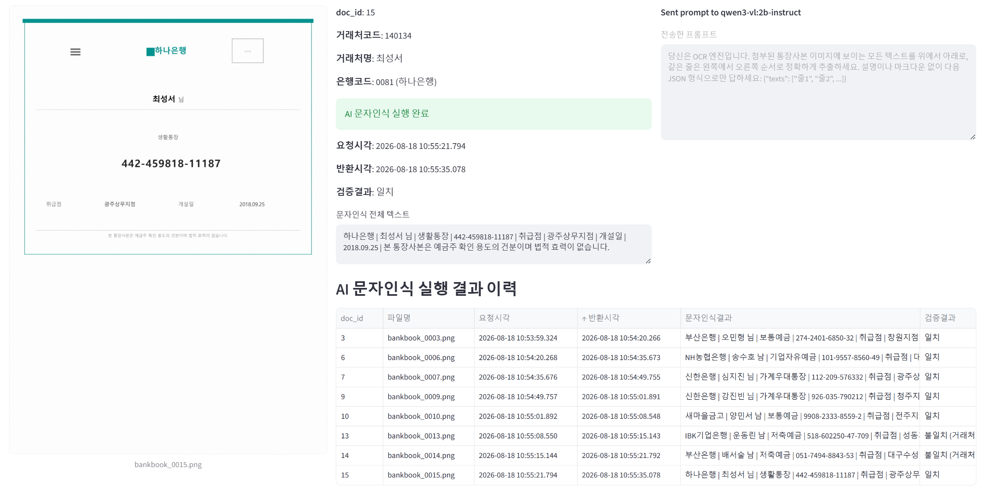
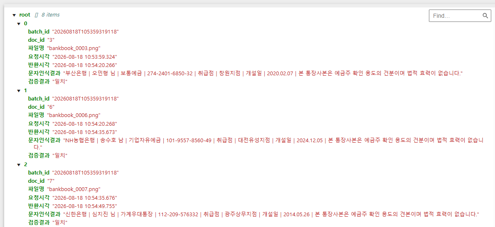

# 통장사본 자동 문자인식 데모

> 통장사본 이미지를 넣으면 OCR/VLM(이미지 속 글자를 읽어내는 기술)으로
> 텍스트를 추출하고, 거래처명·은행명이 맞는지 원본 데이터와
> 자동으로 비교해주는 데모입니다.

## 🚀 바로 실행해보기

**[Streamlit Cloud에서 데모 실행하기](https://vibe-coding-bankbook-dummy.streamlit.app/)**

- 별도 설치 없이 브라우저에서 실행할 수 있습니다.
- Streamlit Cloud에서는 **PaddleOCR 백엔드**로 동작합니다.
- **Ollama + Qwen3-VL 백엔드**는 로컬 실행 환경에서 사용할 수 있습니다.




### 🧪 내 이미지로 직접 테스트하기

데모의 **(3) 내 파일로 문자인식 해보기**에서는 직접 PNG/JPG 이미지를 업로드해 OCR을 테스트할 수 있습니다.

`이미지 업로드 → Resize → Deskew → PaddleOCR → 전체 텍스트 출력`

통장사본뿐 아니라 **텍스트가 포함된 일반 이미지도 사용할 수 있으며**, [`utils/deskew.py`](utils/deskew.py)의 이미지 전처리 기능을 실제 OCR 파이프라인에서 그대로 재사용합니다.

> 공개 데모에는 개인정보·민감정보가 포함된 실제 문서 업로드를 권장하지 않습니다.

이 프로젝트는 **PoC**(개념 증명)입니다. 실제 서비스가 아니라 "이렇게 동작할 수 있다"를 보여주기 위한 작은 데모예요. 사용된 통장사본 이미지도 전부 스크립트로 만든 **가짜(더미) 데이터**이며, 실제 개인정보가 아닙니다.

화면은 **Streamlit**(파이썬 코드만으로 웹 화면을 빠르게 만들어주는 도구)으로 만들어졌습니다.

---

## 🏗️ 미니 시스템 구조



---

## 🧩 What it does

```text
통장사본 이미지 (PNG)
        │
        ▼
  OCR / VLM 인식        ← PaddleOCR 또는 Ollama(Qwen3-VL) 중 하나 선택
        │
        ▼
  인식된 텍스트 줄 목록
        │
        ▼
 CSV에 적힌 거래처명·은행명이
 인식된 텍스트에 들어있는지 확인
        │
        ▼
   "일치" / "불일치" 결과
```

이 프로젝트가 사용하는 원본 데이터는 더미 통장사본 이미지들과, 그 목록이 담긴 CSV 파일입니다.



화면에서 하는 일은 이렇게 정리할 수 있어요:

1. 원본 문서 목록(CSV)이 표로 보이고, 각 행 앞에 **체크박스**가 있습니다.
2. 표 위의 **전체 선택** 체크박스로 한 번에 다 켜거나 끌 수 있습니다.
3. 원하는 행(들)을 체크하고 **실행** 버튼을 누르면, 체크된 것 중 아직 안 돌린 문서만 순서대로 처리됩니다.
4. 방금 체크한 문서의 이미지·인식 결과·(Ollama 사용 시) 실제로 보낸 프롬프트가 옆에 바로 미리보기로 뜨고, 그 아래에 실행 이력 표가 쌓입니다.



---

## ⚙️ Backend 선택

**자동 문자인식**을 처리하는 방식을 두 가지 중에서 고를 수 있습니다.

| Backend  | 설명                                             | 비고                          |
| -------- | ------------------------------------------------ | ----------------------------- |
| `ollama` | 내 PC에서 돌아가는 **VLM**(이미지+언어 AI모델)인 Qwen3-VL 사용 | **기본값**, 별도 서버 없이 로컬 PC에서 실행 |
| `paddle` | 기존에 쓰던 PaddleOCR 엔진 사용                  | 별도 설치 필요 (아래 참고)    |

환경변수 `VLM_BACKEND`로 선택합니다:

```powershell
$env:VLM_BACKEND = "ollama"   # 또는 "paddle"
streamlit run app.py
```

```CMD
set "VLM_BACKEND=ollama"
streamlit run app.py
```

값을 아예 지정하지 않으면 `ollama`가 기본으로 사용됩니다.

> `paddle`을 선택했을 때만 코드가 `paddleocr` 패키지를 불러옵니다. `ollama`를 쓰는 동안에는 PaddleOCR 관련 코드가 아예 실행되지 않으므로, PaddleOCR을 설치하지 않아도 됩니다.

---

## 🚀 Quick Start (Windows 기준)

```cmd
# 1) 프로젝트 폴더로 이동
cd bankbook_dummy

# 2) 가상환경 생성
python -m venv .venv

# 3) 가상환경 활성화
.venv\Scripts\activate

# 4) 필요한 패키지 설치 (Ollama 백엔드 기준)
pip install -r requirements.txt

# 5) 실행
streamlit run app.py
```

실행하면 브라우저에서 `http://localhost:8501`이 자동으로 열립니다.

> `paddle` 백엔드를 쓰고 싶다면 `requirements.txt`에서 `paddlepaddle`, `paddleocr` 두 줄의 주석을 해제하고 다시 `pip install -r requirements.txt`를 실행하세요. `ollama` 백엔드만 쓸 거라면 필요 없습니다.

---

## 🔄 문서 회전 보정 유틸리티

스캔 또는 복사 과정에서 통장사본이 회전된 경우를 테스트하기 위한 간단한 OpenCV 기반 도구가 포함되어 있습니다.

`deskew.py`는 별도의 기준 이미지나 AI 모델 없이 문서 내부의 직선 방향을 분석해 회전 각도를 추정하고 자동으로 보정합니다.

```text
회전된 통장사본
      │
      ▼
 Canny Edge 검출
      │
      ▼
 Hough Line 검출
      │
      ▼
 주요 직선의 각도 추정
      │
      ▼
 자동 회전 보정

```

### 단일 이미지 자동 보정

```powershell
python utils/deskew.py "bankbook.png"
```

예를 들어 입력 이미지가 약 27° 회전되어 있다면 다음과 같이 보정 각도를 추정합니다.

```text
estimated skew : -26.993°
```

보정된 이미지는 원본 파일 옆에 `_deskewed.png` 이름으로 저장됩니다.

### 테스트용 이미지 회전

`rotate.py`는 회전 보정 기능을 검증하기 위해 원본 이미지를 지정한 각도로 회전시킵니다.

```powershell
python utils/rotate.py "bankbook.png" 20
```

음수 각도도 사용할 수 있습니다.

```powershell
python utils/rotate.py "bankbook.png" -12
```

### 여러 이미지 일괄 검증

`batch_test.py`에는 `(이미지 파일, 회전 각도)` 목록을 지정할 수 있습니다.

```python
TEST_CASES = [
    ("output/bankbook_0001.png", 7),
    ("output/bankbook_0002.png", -14),
    ("output/bankbook_0003.png", 23),
]
```

실행:

```powershell
python utils/batch_test.py
```

각 이미지를 지정한 각도로 회전한 뒤 다시 자동 보정하고, 실제 회전각과 추정값의 오차를 요약합니다.

현재 더미 통장사본 10개를 대상으로 약 `-89° ~ +83°` 범위의 합성 회전을 테스트했으며, 평균 절대 각도 오차는 약 `0.026°`, 최대 오차는 약 `0.061°`였습니다.

> 이 기능은 스캔본이나 평평하게 복사된 문서처럼 **회전이 주된 기하학적 왜곡인 이미지**를 대상으로 합니다. 원근 왜곡 보정은 포함하지 않습니다.

---

## 🦙 Ollama 사용법

**Ollama**는 이미지+언어 모델(VLM)을 내 PC에서 직접 돌려주는 실행기입니다. [ollama.com](https://ollama.com)에서 설치할 수 있습니다.

**최초 1회 실행**(AI 모델 설치 등)

```powershell
# 1) Ollama 서버 실행 (설치 후 별도 터미널에서)
ollama serve

# 2) 사용할 모델 다운로드 (최초 1회만)
ollama pull qwen3-vl:2b-instruct

# 더 똑똑하지만 더 무거운 모델을 쓰고 싶다면
ollama pull qwen3-vl:4b-instruct
```

기본으로 사용되는 모델은 **`qwen3-vl:2b-instruct`**입니다. 다른 모델을 쓰려면 환경변수로 바꿀 수 있습니다.

| 환경변수           | 기본값                     | 설명                         |
| ------------------ | -------------------------- | ---------------------------- |
| `OLLAMA_MODEL`     | `qwen3-vl:2b-instruct`     | 사용할 모델 이름             |
| `OLLAMA_ENDPOINT`  | `http://localhost:11434`   | Ollama 서버 주소             |
| `OLLAMA_TIMEOUT`   | `120` (초)                 | 응답을 기다리는 최대 시간   |

```powershell
$env:OLLAMA_MODEL = "qwen3-vl:4b-instruct"
streamlit run app.py
```

Ollama 서버가 꺼져 있거나 모델을 아직 안 받았다면, 화면에 "`ollama serve`를 실행하세요" / "`ollama pull ...`로 먼저 설치하세요" 같은 안내 메시지가 그대로 표시됩니다.

---

## 📄 Example

**입력**: 통장사본 이미지 한 장 (`output/bankbook_0007.png` 같은 PNG 파일)

**출력** (실행 이력 한 줄, 화면에서 표시할 표와 최대한 비슷하게): 아래 값은 예시를 위한 가짜 데이터입니다.

```json
{
  "doc_id": "7",
  "파일명": "bankbook_0007.png",
  "요청시각": "2026-08-18 10:54:20.268",
  "반환시각": "2026-08-18 10:54:35.673",
  "문자인식결과": "신한은행 | 홍길동 | 보통예금 | 123-456-789012 | 취급점 | 강남지점 | 개설일 | 2024.01.01",
  "검증결과": "일치"
}
```

- `문자인식결과`는 이미지에서 읽어낸 텍스트 줄을 `|`로 이어붙인 것입니다.
- `검증결과`는 CSV에 적힌 거래처명·은행명이 이 텍스트 안에 들어있는지 **단순 포함 여부**로 판단한 값입니다 (`일치` / `불일치` / `불일치 (은행명 확인 안됨)` 등).
- 실행할 때마다 이런 기록이 `batch_metadata.jsonl`(배치 요약)과 `batches/*.jsonl`(배치별 개별 결과)에 한 줄씩 쌓입니다.



---

## 📁 Project Structure

```text
bankbook_dummy/
├─ app.py                  # Streamlit UI (실행 진입점)
├─ vlm_backend.py          # OCR/VLM 백엔드 전환 로직 (paddle / ollama)
├─ bank_data.py            # 더미 데이터 생성에 쓰이는 은행 정보
├─ generate_bankbooks.py   # 더미 통장사본 이미지를 만드는 스크립트
├─ utils/
│  ├─ deskew.py            # 문서 회전 각도 추정 및 자동 보정
│  ├─ rotate.py            # 테스트용 회전 이미지 생성
│  └─ batch_test.py        # 여러 이미지/각도 일괄 검증
├─ bankbook_documents.csv  # 더미 문서 목록 (화면에 표시되는 CSV)
├─ requirements.txt        # 설치할 패키지 목록
├─ assets/                 # README용 스크린샷/데모 GIF
├─ output/                 # 생성된 더미 통장사본 이미지들
├─ batch_metadata.jsonl    # 실행(배치)마다 쌓이는 요약 로그 (실행 후 생성)
├─ batches/                # 배치별 개별 인식 결과 (실행 후 생성)
└─ README.md
```

---

## ⚠️ Notes / Limitations

- 이 코드는 **PoC**(데모)입니다. 실제 서비스용 시스템이 아니며, 여러 사용자가 동시에 쓰는 상황은 고려하지 않았습니다.
- AI/OCR 인식 결과는 항상 정확하지 않을 수 있습니다.
- 검증은 "거래처명·은행명 글자가 인식된 텍스트 안에 포함되어 있는가"만 확인하는 단순한 방식입니다.
- Ollama 로컬 모델의 속도와 정확도는 사용 중인 PC 성능에 따라 크게 달라집니다.
- 이미지 1장 인식에 수십 초가 걸릴 수 있습니다.
- 모든 통장사본 이미지는 스크립트로 만든 가짜 데이터이며 실제 개인/계좌 정보가 아닙니다.
